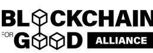
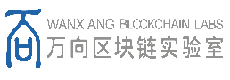
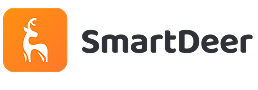

# My First DApp 休闲黑客松

<!-- [English](/docs/README_EN-US.md) | [简体中文](/docs/README_ZH-CN.md) -->

🧬 这是一次大胆、轻松愉快、不卷的黑客松。我们不强求技术壁垒，而是鼓励跨界创意。就算你没有代码基础，也可以借助 AI 工具生成代码模块，非技术类参赛者也可以用 Figma 画一个界面、写一份提案、录一个 Demo 视频——我们要的是“理念呈现与思维创新”，加入黑客松，开启你的 DApp 初体验！

## 01 | 报名方式与议程安排
📍 线上举行｜自由报名（面向所有人，非实习计划成员不参与激励评选）

| 活动           | 时间                  | 形式    | 相关链接                |
| --------------- | --------------------- | --------- | ------------------------------ |
| **开始报名**    |  8月18号 (UTC+8) | 📍 线上 | [立即报名](https://github.com/CasualHackathon/MyFirstDapp/issues/new?title=Registration&body=Name%5B%E5%A7%93%E5%90%8D%5D:%0A%0A%E5%BE%AE%E4%BF%A1/TG%EF%BC%8C%E6%8E%A8%E8%8D%90%E5%BE%AE%E4%BF%A1%0AContactMethod%5B%E8%81%94%E7%B3%BB%E6%96%B9%E5%BC%8F%5D:%0A%0A%E6%98%AF%E5%90%A6%E6%84%BF%E6%84%8F%E4%B8%8E%E4%BB%96%E4%BA%BA%E4%B8%80%E8%B5%B7%E7%BB%84%E9%98%9F%E5%8F%82%E5%8A%A0%0AWantsTeam%5B%E7%BB%84%E9%98%9F%E6%84%8F%E6%84%BF%EF%BC%88%E6%98%AF/%E5%90%A6%EF%BC%89%5D%EF%BC%9A%0A%0A%E5%8F%AF%E4%BB%A5%E8%AF%B4%E4%B8%8B%E7%BB%84%E9%98%9F%E6%97%B6%E6%84%BF%E6%84%8F%E5%9C%A8%E9%98%9F%E4%BC%8D%E4%B8%AD%E6%89%BF%E6%8B%85%E9%82%A3%E9%83%A8%E5%88%86%E4%BB%BB%E5%8A%A1%0AComment%5B%E5%A4%87%E6%B3%A8%5D:) |
| 🗓**Open Day**  |  8月22号, 18:30 (UTC+8) | 📍 线上 | [提交 Demo](https://github.com/CasualHackathon/MyFirstDapp/issues/new?title=Submission&body=ProjectName%5B%E9%A1%B9%E7%9B%AE%E5%90%8D%E7%A7%B0%5D:%0A%0ABrief%20description%20about%20your%20project%20in%20one%20sentence%EF%BC%88%E7%AE%80%E8%A6%81%E6%8F%8F%E8%BF%B0%E6%82%A8%E7%9A%84%E9%A1%B9%E7%9B%AE%EF%BC%89%0AProjectDescription%5B%E9%A1%B9%E7%9B%AE%E6%8F%8F%E8%BF%B0%5D:%0A%0A%20Your%20wallet%20address%20or%20ENS%20domain%20on%20Ethereum%20mainnet%EF%BC%88%E6%82%A8%E5%9C%A8%E4%BB%A5%E5%A4%AA%E5%9D%8A%E4%B8%BB%E7%BD%91%E4%B8%8A%E7%9A%84%E9%92%B1%E5%8C%85%E5%9C%B0%E5%9D%80%E6%88%96%20ENS%20%E5%9F%9F%E5%90%8D%EF%BC%89%0AWalletAddress%5B%E9%92%B1%E5%8C%85%E5%9C%B0%E5%9D%80%5D:) |
| 🏁**Demo Day** |  8月24号, 18:00 (UTC+8) | 📍 线上 | - |

**报名教程：** [bilibili]( https://www.bilibili.com/video/BV1CPb7zyEsY/?share_source=copy_web&vd_source=2018ba63d31c5220d8024a775104e4cc)，[youtube](https://www.youtube.com/watch?v=dd-dwlpwYm4)

**注意事项：**
  1. 禁止修改他人信息
  2. 提交 Demo 时必须先完成注册，否则提交无效。
  3. 提交资料时，只在对应位置填写信息，不要修改其它基础内容。
  4. 提交报名后，预计1分钟内会显示在下方报名列表中，如未显示请联系相关技术人员。
  5. 提交 Demo 时，请先 Fork 当前代码库，然后将 Demo 相关代码，放到以你 Github ID 命名的目录下，如：`/submission/[your-github-account]`，然后再提交 PR，我们会在审阅后合并，禁止修改其它信息

### 📝 报名列表

<!-- Registration star -->
| 姓名 | GitHub ID | 联系方式(微信*/TG) | 组队意愿 | 备注 | 更新资料 |
| ---- | ----------- | ----------- | ----------- | ------- | ------- |
| Jessie | XXXJCSAMA | @jessiewang_0914 | 是 |合约开发 | [更新](https://github.com/CasualHackathon/MyFirstDapp/issues/new?title=Registration%20-%20Jessie&body=Name%5B%E5%A7%93%E5%90%8D%5D%3A%20Jessie%0Aundefined%3A%20XXXJCSAMA%0AContactMethod%5B%E8%81%94%E7%B3%BB%E6%96%B9%E5%BC%8F%5D%3A%20%40jessiewang_0914%0Aundefined%3A%20%E6%98%AF%0AComment%5B%E5%A4%87%E6%B3%A8%5D%3A%20%E5%90%88%E7%BA%A6%E5%BC%80%E5%8F%91) |
| 暖冬 | Zyuhui008 | 19823242514 | 是 |纯萌新，愿意听指挥去做 | [更新](https://github.com/CasualHackathon/MyFirstDapp/issues/new?title=Registration%20-%20%E6%9A%96%E5%86%AC&body=Name%5B%E5%A7%93%E5%90%8D%5D%3A%20%E6%9A%96%E5%86%AC%0Aundefined%3A%20Zyuhui008%0AContactMethod%5B%E8%81%94%E7%B3%BB%E6%96%B9%E5%BC%8F%5D%3A%2019823242514%0Aundefined%3A%20%E6%98%AF%0AComment%5B%E5%A4%87%E6%B3%A8%5D%3A%20%E7%BA%AF%E8%90%8C%E6%96%B0%EF%BC%8C%E6%84%BF%E6%84%8F%E5%90%AC%E6%8C%87%E6%8C%A5%E5%8E%BB%E5%81%9A) |

<!-- Registration end -->

### 🎯 Demo 提交情况

<!-- Submission start -->
| 项目名称 | 项目描述 | 成员 | 提交状态 | 更新资料 |
| ----------- | ----------------- | -------------- | ------ | -------- |

<!-- Submission end -->

## 02 | 什么是休闲黑客松？

由 **ETHPanda** 联合 **LXDAO** 发起，旨在回归黑客松的探索精神，**轻松、自由、无压力**。

**✍ 短周期 & 远程**：2-3 天线上活动，全球线上协作。

**🧠 无压力创作**：不设严苛评分，鼓励脑洞与实验。

**✨ 人人有奖**：每个项目都会获得认可。

**👥 社交共创**：结识同好，持续交流。

## **03 | 「My First DApp」黑客松**

「My First DApp」黑客松专为 **Web3 初学者和爱好者**量身打造，**对零基础友好**，可借助 AI 工具辅助，完成你的首个 DApp！

**灵感方向（不限于）**：

🎯 生活助手类：记录健康数据（如运动、睡眠），通过智能合约自动提醒和奖励达成健康目标。

👥 社交互动类：创建去中心化社交平台，用户可自由发布信息、互动，数据个人私有不受限。

🛵 众包兼职类：搭建透明、安全的兼职平台，用户可发布和接受任务，智能合约保障交易公正性。

📚 学习教育类：建立区块链学习管理系统，记录学习进度、成绩和证书，提供不可篡改的学习档案，或开发知识问答平台，实现知识有偿分享和激励。

**不写代码？没问题！**

🎨 用 Figma 画界面

✍ 用 Notion 写提案

🎥 录 Demo 视频

**✨ 核心：创意 + 概念验证，非技术炫技。**

## **04 | 适合谁参加？**

**🤖 零基础新手**：不会写代码，也可以借助 AI 等低代码工具辅助参与其中

**👾 技术大佬**：如果你是编程高手，可以在这里尝试新技术，挑战复杂项目。

**🎨 设计师与创意人**：你可以用 AI 生成艺术、设计 UI / UX，为项目增添创意。

**📸 运营与社区达人**：如果你擅长营销、内容策划，可以帮团队放大作品影响力。

**💪 跨行业爱好者**：欢迎任何领域对 Web3 爱好者，只要有兴趣，都可以加入。

## **05 | 我们提供**

✨ 灵感墙、选题引导、组队协助

👨‍👩‍👧‍👦 ETHPanda & LXDAO 核心成员的陪跑与点评

🙌 轻松线上氛围，无需通宵打榜

🏆 人人有奖，只要分享就有反馈

👏 优胜项目可获得后续孵化与推荐

## **06 | 为什么要做这件事？**

🏃 降低 Web3 入门门槛，让新手在**轻松实践**中迈出第一步。

**🚀 这个夏天，不卷商业计划，只玩创意，借助 AI 工具 ，开启你的 DApp 初体验吧！**

## 🤝 联合组织

<table>
    <tr>
        <td  align="center" valign="middle">
            
        </td>
        <td  align="center" valign="middle">
            
        </td>
    </tr>
</table>

## 💰 赞助商

<table>
    <tr>
        <td align="center" valign="middle">
            
        </td>
    </tr>
</table>

## 🌐 社区支持

<table>
    <tr>
        <td  align="center" valign="middle">
            
        </td>
        <td  align="center" valign="middle">
            
        </td>
        <td  align="center" valign="middle">
            
        </td>
        <td  align="center" valign="middle">
            
        </td>
    </tr>
</table>

